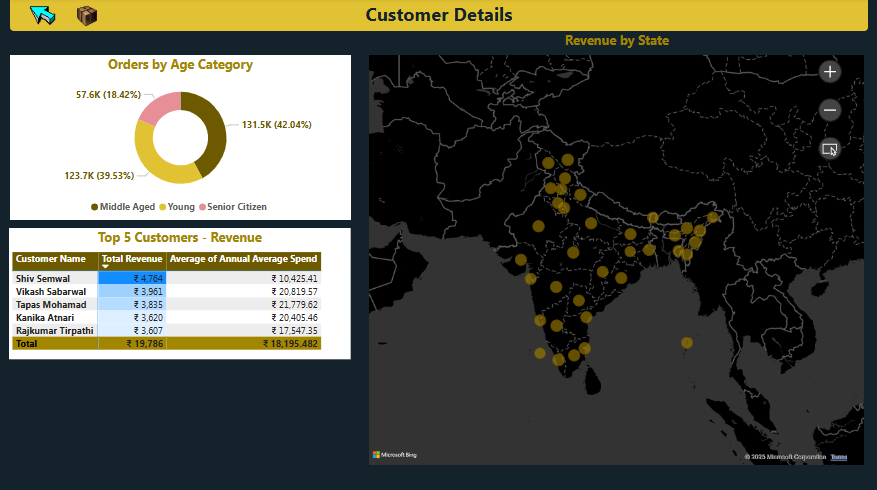

#  Sales Performance Power BI Dashboard

This project presents a comprehensive **Sales Performance Dashboard** developed using **Power BI**, designed to visualize and analyze sales, product, customer, and return-related data. The dashboard allows business users and analysts to monitor revenue, profit, customer behavior, and return patterns effectively and make data-driven decisions.

---

##  Datasets Used

The project uses **four different datasets**, simulating a real-world business scenario:

1. **Sales Transactions Dataset**
   - Fields: Transaction ID, Date, Time, Product ID, Customer ID, Quantity, Price
2. **Product Dataset**
   - Fields: Product ID, Product, Category, Brand, Cost
3. **Customer Dataset**
   - Fields: Customer ID, Name, Gender, Address, Email, etc.
4. **Returns Dataset**
   - Fields: Return ID, Transaction ID, Return Date, Quantity

---

##  Tools & Technologies

- **Power BI**
- **Microsoft Excel**
- **DAX Functions**
- **Data Modeling Techniques**

---


## Analytical Approach
- **Data Cleaning & Transformation**: Performed using Excel to ensure consistency in product IDs, categories, and date formats.

- **Data Modeling**: Built relationships across all four datasets using Power BI’s data model.

- **KPI Creation**: Used DAX to derive new insights such as profit margin, discount percentage, return ratio, and top-performing categories.

- **Visualization**: Created slicers and filters to dynamically explore performance by demographic and geographic dimensions.


---

##  Measures & Metrics Calculated

- Total Revenue  
- Total Profit  
- Order Quantity  
- Return Rate (%)  
- Total Number of Customers  
- Total Cost  
- Discount Percentage  
- Profit Margin (%)  
- Sales by Brand, Category, and Gender

---

##  Dashboard Features

- Interactive filters and slicers for dynamic data exploration  
- Visual breakdown of revenue and profit trends over time  
- Category and brand-wise performance analysis  
- Customer segmentation insights  
- Return impact analysis and trend tracking  
- Geo-location-based sales distribution 

---


##  Key Insights

-  **Total Revenue and Profit**: Achieved significant revenue growth with **insights into overall profit margins**, supporting better pricing and discount strategies.
-  **Top 5 Product Categories**: Accounted for a **major share of order quantity**, helping to identify high-demand segments and optimize inventory planning.
-  **Customer Insights**:
  - Analyzed **order distribution by gender**, revealing that one gender group contributed to over **60% of total purchases**.
  - Segmented **customers by age category**, showing that customers aged **25–40** made up the largest purchasing group.
  - Identified **top-performing customers** by total revenue, with the top 10 customers generating **20%+** of total sales.
-  **Geographic Trends**:
  - Revenue by **state/location** highlighted high-performing regions, allowing for targeted regional strategies.
-  **Order vs. Returns**:
  - Visualized return trends relative to total orders, revealing a **return rate of ~10–12%**, impacting overall profit.
-  **Target Revenue Tracking**:
  - Compared actual revenue against targets, identifying underperforming periods for strategy refinement.
-  **Order Quantity Analysis**:
  - Detailed metrics on total order volume and trends across product categories, customer demographics, and return behaviors.
-  **Filterable Measures**:
  - All KPIs were made interactive and filterable by attributes like **gender, product category, and customer segment**, enabling flexible, on-demand exploration of business insights.


---


##  Dashboard Preview

### Sales Analysis 


### Customer Details


### Product Details


---

##  Project Structure

```bash
 Sales-Performance-PowerBI-Dashboard
│
├──  Dashboard.pbix
├──  README.md
├──  Datasets
│   ├── sales_transactions.csv
│   ├── product_data.csv
│   ├── customer_data.csv
│   └── returns_data.csv

```

---

##  How to View the Dashboard

To view the Power BI Dashboard:

1. Download the `.pbix` file from this repository.
2. Open the file in **Power BI Desktop**.
3. Interact with the visuals, slicers, and filters to explore insights.

---

##  Conclusion

This project showcases the ability to **model and analyze multi-source datasets**, calculate key business metrics, and visualize them using a dynamic dashboard. It demonstrates proficiency in **Power BI**. DAX, and storytelling through data visualization.

---

